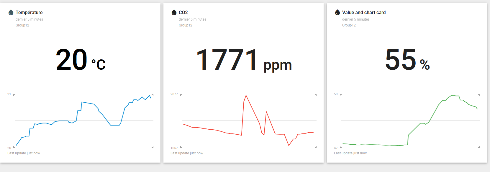

# EN326 cberthelot picazenave

## Utiliser le repo

- `git clone git@github.com:picazenave/EN326.git`
- `cd EN326`
- `workon mbed-os` (remplacer `mbed-os` avec le nom de son environnement)
- `mbed deploy`
- `mbed compile`
- `sixtron_flash`

Le `.mbed` est déjà configuré avec la target et la toolchain.

La sortie standard est la suivante :

~~~bash
LORA_ANTSW_PWR set to 1
-- CO2 ppm:1829|temp:19.92°C|RH:47.31%
scd4 init done
led_thread started

Mbed LoRaWANStack initialized

CONFIRMED message retries : 3

Adaptive data  rate (ADR) - Enabled

Init done ...

Connection - In Progress ...
-- CO2 ppm:1837|temp:19.93 °C|RH:47.32 %
~~~

La ligne : `LORA_ANTSW_PWR set to 1` reste affichée pendant 5sec le temps que le capteur s'initialise.

Si la carte se connecte à la GateWay des debugs du Lora apparaissent.

## Threads

La led et le capteur sont mit à jour sur un thread different de la tâche Lora.

La carte n'est pas utilisé en Bare-metal.

## Dashboard

## Problemes portée

`LORA_ANTSW_PWR` n'est donné à la classe LoraRadio à sa création. Le pin est forcé à 1 au début du `main`.

~~~cpp
SX1272_LoRaRadio radio(LORA_MOSI, LORA_MISO, LORA_SCK, LORA_CS, LORA_RESET, LORA_DIO0, LORA_DIO1, LORA_DIO2, LORA_DIO3, LORA_DIO4, LORA_DIO5);
~~~

## Explication du mbed_app.json

Activation de `sprintf` et `printf` avec des flottants (`%f`) et 2 décimales après la virgule :

~~~json
"target.printf_lib": "minimal-printf",
"platform.minimal-printf-enable-floating-point": true,
"platform.minimal-printf-set-floating-point-max-decimals": 2,
"platform.minimal-printf-enable-64-bit": false,
~~~

Forcer l'activation des traces de DEBUG et leurs affichage en cas de crash, obligatoire avec les options suivantes pour une raison inexpliqué :

~~~json
"mbed-trace.enable": true,
"mbed-trace.max-level": "TRACE_LEVEL_DEBUG",
"platform.stdio-flush-at-exit":true,
~~~

Configuration du LORA et du composant LORA utilisé :

~~~json
"lora.over-the-air-activation": true,
"lora.duty-cycle-on": true,
"lora.phy": "EU868",
"lora.device-eui": "{ 0x9a, 0x9e, 0x4b, 0x76, 0xed, 0xbe, 0x71, 0x27 }",
"lora.application-eui": "{ 0X10, 0xCE, 0x45, 0xFF, 0xFE, 0x00, 0x8C, 0x7E }",
"lora.application-key": "{0x50,0x03,0x79,0xf8,0x82,0x92,0x11,0x88,0xcc,0x6d,0x5b,0x46,0x50,0x9b,0xce,0xe8}",
"target.components_add": [
    "SX1272"
],
~~~

Réduction de la taille du stack IP :

~~~json
"lwip.ethernet-enabled": false,
"lwip.mbox-size": 1,
"lwip.mem-size": 256,
"lwip.num-netbuf": 1,
"lwip.socket-max": 1,
~~~

Réduction de la taille du stack pour les différents threads :

~~~json
"rtos.main-thread-stack-size": 2048,
"rtos.thread-stack-size":1024,
~~~

Option de compilation pour passer en argument à la compilation `Os` :

~~~json
"target.c_lib": "small"
~~~